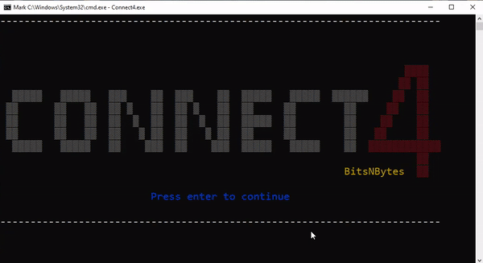

# Connect4

## The repository
This is the repository of a Connect4 game developed in C by our team, BitsNBytes.
 - The first stage of the project is to implement the game and its interface, allowing two human players to play in the terminal.
 - The second stage consists of developing a bot that plays against a human player.  

For further information, see the [project guidelines](Project_Guidelines.pdf).

## Additional features
 1. Making a nice looking interface with designs, colors and animations.
 2. Giving the bot difficulty settings: `Easy`, `Medium` and `Hard`. More settings can be added very easily.
 3. Implementing 3 possible game modes: `Multi-Player`, `Single-Player` and `Simulation` (the `Simulation` mode allows two bots to play against each other).

## Demo


## Compilation

#### MacOS and Linux
```sh
make
```
#### Windows
```sh
mingw32-make -f Makefile
```

## Platform support
Tested on Linux (Manjaro), Mac OS, and Windows 10.

## License
Licensed under the [GNU General Public License v3.0](LICENSE) license.

```
 /\______________/\              __
|                 |              \ \
|  --  vv   --    |_________     / /
\________________/          \__/ /
|                             __/
|                            |
|_|-----|_|---------|_|---|_|
```